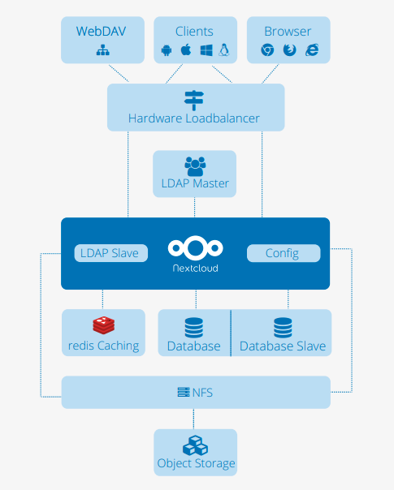
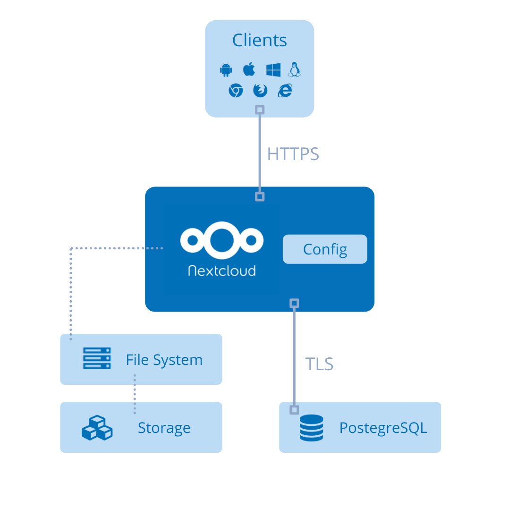

# NSS-Cloud Report
## 0 TOC

- [1 System Goals](#1-system-goals)
	- [1.1 Qualitative Goals](#11-qualitative-goals)
	- [1.2 Quantitative Goals](#12-quantitative-goals)
	- [1.3 Use Cases](#13-use-cases)
- [2 System architecture](#2-system-architecture)
	- [2.1 Nextcloud server architecture](#21-nextcloud-server-architecture)
	- [2.2 NSS-cloud adoption](#22-nss-cloud-adoption)
- [3 Components](#3-components)
	- [3.1 Nextcloud](#31-nextcloud)
	- [3.2 PostegreSQL](#32-postegresql)
	- [3.3 LDAP](#33-ldap)
	- [3.4 Certification BOT](#34-certification-bot)
	- [3.5 Clients](#35-clients)
- [4 Communication](#4-communication)
- [5 Open source modules evaluation](#5-open-source-modules-evaluation)
	- [5.1 Nextcloud](#51-nextcloud)
	- [5.2 Let's Encrypt](#52-lets-encrypt)
	- [5.3 Optional nss-ca](#53-optional-nss-ca)
- [6 Fallacies](#6-fallacies)
	- [6.1 Network is reliable](#61-network-is-reliable)
	- [6.2 Latency is zero](#62-latency-is-zero)
	- [6.3 Infinite bandwidth](#63-infinite-bandwidth)
	- [6.4 Network is secure](#64-network-is-secure)
	- [6.5 Topology doesn’t change](#65-topology-doesnt-change)
	- [6.6 There is one administrator](#66-there-is-one-administrator)
	- [6.7 Transport cost is zero](#67-transport-cost-is-zero)
	- [6.8 Network is homogeneous](#68-network-is-homogeneous)
- [7 Further development](#7-further-development)
	- [7.1 Deployment](#71-deployment)
	- [7.2 Federation](#72-federation)
	- [7.3 Additional Services and Features](#73-additional-services-and-features)
	- [7.X Others](#7x-others)
- [8 Evaluation](#8-evaluation)
- [9 Conclusion / Learning](#9-conclusion-/-learning)

## TBC Introduction?
This report discusses the inevitable heat death of the universe that is looming *almost* behind the corner.
　
## 1 System Goals
This section introduces primary goals of the system and serves as a basis for all decisions regarding the practical implementation of the system. The goals can generally be divided into two categories, qualitative goals and quantitative goals, though some may also fall into both. Additionally, we describe some potential use cases as keeping them in mind will allow us to design our system from the ground up to be used effectively in practice.

### 1.1 Qualitative Goals
**Privacy** is one of the core drivers and goals of this project. As more and more data, services, and even infrastructure (e.g. DNS resolution) are being centralized by the top players in the cloud industry, there is an increasing need for alternate options for those who need a guarantee of privacy and data confidentiality (resources TBC - confidential dns, confidential computing, GDPR). This need could be to some extent satisfied with personal cloud deployment on local network or self-hosted cloud.

**Security** goes hand-in-hand with privacy, as there cannot be any true privacy if the service is insecure, even if it is being self-hosted. This is also especially important considering that it is a "personal" cloud, which should be secure enough to safely store any sensitive personal data that users store on it.

### 1.2 Quantitative Goals
Depending on the use case, some quantitative metrics may be required or at least welcomed by the consumer.

**Reliability** of the service is crucial, and users' data should remain accessible and loss-proof at all times. The entire point of a personal cloud is storage, and if the service is unreliable and data is inaccessibly or lost, then it is a complete failure of the system.

**Performance** is use case and deployment-specific, but the software and protocols should introduce minimal performance overhead and be capable of running on low-end consumer machines, e.g. NUCs. Data storage is now a relatively simple task, especially at the basic consumer level, so poor performance should be a cause for concern.

### 1.3 Use Cases
To what end a user would like to utilise the system may widely vary. However, we will introduce few use cases for the NSS-cloud system.

The most basic and perhaps intended usage of the personal cloud is as a storage and sharing platform similar to other widely-used cloud platform (Google, iCloud etc.). However, due to its locality and low amount of users, the consumer benefits with high privacy guarantees and potentially much higher performance (HW dependant). This of course comes at the cost of wide availability outside of the local network. The tradeoff can be somewhat balanced by self-hosting the system, which on the other hand increases the attack surface.

Another use could be seen by combination of the personal cloud with a home assistant (e.g. open source [Home Assistant](https://www.home-assistant.io/)), which would have similar benefits as above mentioned use case. Additionally, this would lower chance of external misuse and improved responsiveness and debugging of the home assistent settings. 

One rather complex, DIY-style, application could be seen with development of custom security cameras. That could potentially be even connected to the previous use case. One could recycle old smartphone to serve as a security camera feed (e.g. over TLS) to the home server, where for example with framework like [OpenCV](https://opencv.org/) the images are processed for object detection or individuals identification. The personal cloud could play various roles in this model, from data processing, storing to interfacing such model using its API, and mitigating the thread of possibly sensitive data leakage.

## 2 System architecture
### 2.1 Nextcloud server architecture

*Figure 1 - Scalable Nexcloud setup example. Nextcloud server at the center, NFS (Network file system) as storage layer at the bottom, an LDAP (Lightweight Directory Access Protocol) user directory, REDIS caching, multiple databases and loadbalancer.  [\[NC-WP\]](#nc-wp)*

The core of a Nextcloud setup is the Nextcloud server, which is a PHP-based web application for a Linux webserver such as Apache or NGINX. A typical deployment uses the "LAMP" stack: Linux, Apache, MySQL/MariaDB, and PHP. The database in the stack (MySQL/MariaDB are recommended but PostegreSQL is also supported) stores file sharing information, user details, application data, configuration and file information for the Nextcloud server. For the storing of files, Nextcloud's storage layer supports many server-mounted storage protocols, though an off-the-shelf NFS such as IBM Elastic Storage  or  RedHat  Ceph is recommended and most often used. The storage layer can be run on the same server as Nextcloud, or on a different server through the Nextcloud interface. [\[NC-WP\]](#nc-wp)

There are a variety of options for accessing and managing the data stored within a Nextcloud instance. Nextcloud's web interface is supported across all major browsers and operating systems, and allows users to access and manage their stored files. Nextcloud also offers official desktop (Windows/macOS/Linux) and mobile (Android/iOS) applications with file syncing capabilities. Nextcloud fully supports WebDAV as well, so file management can be done directly through the operating system (i.e. mapping a network drive in Windows) or with third-party applications that support WebDAV such as Filezilla.

### 2.2 NSS-cloud adoption

*Figure 2 - NSS cloud architecture. Clients connect to Nextcloud over HTTPS. The default OS filesystem is used as the storage layer. The PostgreSQL database runs in a container accessed via TLS.*

Since our primary goal is a personal-use of the cloud server for file storage (see [1.3 Use Cases](#13-use-cases)), we do not expect a high-traffic environment and the whole system should be able to fit on low-spec consumer hardware (e.g. NUC). This means that many of the additional features depicted in the scalable Nextcloud setup[Figure 1](#figure-1) are unneccessary and can be eliminated to save on space, processing power, and complexity. Specifically, the REDIS caching server, the hardware loadbalancer, multiple seperate database servers, and even NFS for the storage layer are not required for our use case. Hence, our setup is structured as depicted in [Figure 2](#figure-2).

The Nextcloud server system is setup to run within a single virtual machine (VM). The VM is CSC cPouta standard.small [\[Pouta-Flavors\]](#pouta-flavors) flavor. It has 2 vCPUs and 2GB RAM allocated to it, and contains a minimal default installation of the Ubuntu Server 20.04 operating system.  The Nextcloud server is natively installed and configured on the VM's operating system, rather than in a container). The system's database is a PostgreSQL database running inside of a Docker container hosted by the VM. Communication to and from the PostgreSQL server is done over TLS. The database has restricted access to resources, with 384MB for storage (plus additional 384MB swap space) and is limited to at most 0.5 vCPU usage. The Linux native file system interface is used for object storage.

Clients can connect using either the Nextcloud app available on all major operating systems or via the web browser interface. 

## 3 Components

As stated above, the system as a whole runs within a VM running Ubuntu Server 20.04 containing an Apache webserver. For administration purposes, the VM itself exposes a port to the Internet for secure SSH connection. Ports are also exposed to allow clients to connect to the webserver via HTTPS and manage files using Nextcloud's web interface.

### 3.1 Nextcloud
NSS-cloud's most important component is the Nextcloud server instance. It is directly installed ([Nextcloud docs](https://docs.nextcloud.com/server/latest/admin_manual/installation/source_installation.html)) in the VM inside the webserver, and the installation also comes bundled with all of the required PHP modules. The Nextcloud server is primarily responsible for managing file access and processing for NSS-cloud, acting as the mediator between users/clients and the files stored on the server. The exposed ports in the webserver allow clients to connect to the Nextcloud server via HTTPS and access/manage the files stored within. The Nextcloud server also requires the usage of a database, which it connects to using TLS 1.3.

### 3.2 PostgreSQL
The database used by NSS-cloud for its Nextcloud server instance is a PostgreSQL database. It is hosted on the same VM as the Nextcloud server, though within a Docker container. The database is used by the the Nextcloud server to store file sharing information, user details, application data, configuration and file information, as mentioned in [Section 2.1](#21-nextcloud-server-architecture). It is only connected to the Nextcloud server outside the Docker container, via TLS 1.3. 

### 3.3 LDAP
User authentication for NSS-cloud is managed by LDAP. LDAP was chosen as it is recommended for use with Nextcloud, vendor-neutral with a compatible php version, simple, and lightweight. For LDAP authentication to be used, an LDAP server is required, which in this case is hosted within a Docker container on the same VM as the Nextcloud server (similar to the database). The LDAP server communicates with the Nextcloud server using a secure TLS connection.

### 3.4 Certification BOT (Certbot by EFF)
Certbot maintains NSS-cloud's Let's Encrypt certificate. A valid certificate issued by a Certificate Authority that proves one has control over a domain is required to use secure protocols such as TLS and HTTPS (which is based on TLS). Let's Encrypt offers a free certificate service, however each certificate is only valid for 90 days, so Certbot automatically renews the certificate when it expires. It has minimal contact with most of the system, and only contacts Let's Encrypt to renew the certificates and then saves them to Apache for Nextcloud and PostgreSQL to use for TLS and HTTPS connections.

## 4 Communication
	Communication channel between the modules. For instance, do the modules use secure communication to communicate with each other, if yes, how?

The main mode of communication between modules is TLS 1.3, which the Nextcloud server uses to communicate with the PostgreSQL database and the LDAP server. TLS stands for Transit Layer Security, and is a cryptographic communication protocol for computer networks.

The ip that Nextcloud is using is force in the configuration to use only TLS. So there is no possiblilty that the connection would not be encrypted. The certificate is also from Lets Encrypt and are copied during Docker init from diskdrive to PostgreSQL configuration directory and also TLS is put on with commandline option. SSL must be used if the database is not on the same server as the Nextcloud instance, which is not currently the case with our project.

## 5 Open source modules evaluation
	Pros and cons of the open-source components/modules used for developing the system, and the modules/components you have built (3 points)

*Open source is the way forward and any proprietary solution should be heavily build on open source. No need to keep reinventing wheel. (TBC reference based open source rant?)*

### 5.1 Nextcloud
One major benefit of Nextcloud is that it is free and open source, which makes it affordable for individual consumers (and students). As we have mentioned above, privacy and security are two major consideration when it comes to a personal cloud, and the fact that Nextcloud is open source makes it easy for end users or other third parties to audit the software, without having to rely only on trusting the Nextcloud organization when they say their software is secure. This can also be a drawback, however, because the code is also visible to potential malicious parties, who can easily read the code and find bugs or other weaknesses that can be exploited. Another benefit for consumers is that Nextcloud can run very lightweight on inexpensive, easy to acquire hardware such as a RaspberryPi, though also offers the option to scale up very large for those who might need it. On the development side, the modular architecture of Nextcloud allows developers like our group the option to extend it with custom features, or with other useful extensions developed by third parties. Nextcloud also has very easy, beginner-friendly basic setup, and fairly comprehensive documentation that makes it easy to work with, even as a newcomer.

### 5.2 Let's Encrypt
It is difficult to find many flaws with Let's Encrypt, which is free, simple, quick, and very well documented. One downside arguably is that Let's Encrypt certificates only last 90 days, which can lead to downtime if they are not renewed on time since TLS and HTTPS connections will stop working without a valid certificate. However, using the EFF's Certbot (also free and open source) as we did, this becomes a trivial issue as Certbot automatically takes care of renewing the certificates when they expire. Another possible downside is the fact that Let's Encrypt only offers domain-validated certificates, but the other certificate types (Extended validation and organization validation) are not at all neccessary for the scope of this project. For our purposes, Let's Encrypt was clearly the best choice and had no significant downsides.

### 5.3 PostgreSQL
As with many other components used in this project, PostgreSQL is free and open source. It's known to have quite good performance and fast data access, which is beneficial for running on potentially lower-spec consumer hardware. It also has improved data integrity, as it doesn't change data by automatically correcting data types. However, this can also be a downside to some, as the convenience of automatic correction is sometimes worth the drop in data integrity. PostgreSQL also has some optimization features such as Partial Indexing, but those probably aren't needed in a personal cloud. One major downside related to our specific architecture is that the usage of PostgreSQL with Nextcloud isn't as smooth as with MariaDB/mySQL, as PostgreSQL isn't explicitly recommended for use with Nextcloud. However, due to some issues detailed later on in the report, PostgreSQL had to be settled for. Also, for a small project, PostgreSQL may be more robust than necessary, and other options such as mariaDB could offer smaller database sizes in exchange, for example. Lastly, PostgreSQL doesn't support table partitioning, which could sometimes be a nice feature to have.

### 5.4 Optional nss-ca
certificate chain generation and signing script. Based on widely used OpenSSL.
- good enough for personal usage
- openssl and crypto in general is not easy and user friendly
- cannot be trustworthy otherwise

Bla bla bla OpenSSL crap and ambiguous documentation etc.

## 6 Fallacies
	Which of the fallacies of the distributed system does your system violate, and how?

### 6.1 Network is reliable
The network doesn't allways be reliable for our application, but if network failures happen too often or if the file that is being downloaded/uploaded is very big things can get annoying. Downloading and uploading are prone to failure if the network isn't reliable enough which can lead to the entire process being restarted. This becomes increasingly annoying as the size of the file grows and network reliability goes down. Having to restart 1 hour long download multiple times starts to eat away at person's will to live.
- check if nextcoud mitigades e.g. upload interrupts / session resumption etc (I'd assume so since basic HTTPS config generally supports this on lower levels)

### 6.2 Latency is zero
- personal network (local), we do not care so much about the latency
- may be considered for self hosting somewhere and implementing e.g. WebRTC based audio/video chat

### 6.3 Infinite bandwidth
Our solutions don't have much to do with bandwidth as personal cloud should not be clogged up by multiple users, but we naturally avoid having too much unnecessary data loading that could slow down the user's experience.

### 6.4 Network is secure
Our system secures client communication with HTTPS and internal with TLS. Further consideration could be made to run the system in HSM based secure VM (e.g AMD-SEV/SNP, Intel TDX or Arm CCA in the future) or shifting the system to a container rather than VM and bootstrapping it with HSM (Intel SGX, RISC-V Keystone, TPM 2.0 etc.). This would secure internal communication and compute to the extent that even a physical access to the system would not reveal any sensitive information*.

*We're aware of side channel attacks vulnerabilities of mentioned systems and their are out of the scope of this project.

### 6.5 Topology doesn’t change
- TBC

### 6.6 There is one administrator
Nextcloud support multiple administrators, and further specified roles can be delegated to support customized administration topology. [\[NC-WP\]](#nc-wp)

The underlying OS (Ubuntu 20.04) also supports multiple users which can belong to different administrative groups. These users can be accessed through ssh and multiple users can connect at the same time. **(Some Reference here)**

### 6.7 Transport cost is zero
For personal cloud this is largely irrelevant. The infrastructure of personal home server wouldn't normally be that big and when renting cloud services, personal server doesn't need unpredictable scaleable solutions. In the data transfer itself, in finland, the only thing that usually costs something is the bandwidth and not the amount of data (at least on personal scale). For users that have limited data, the thing that can be done is that loading unecessary data is avoided. For eample only small previews of the images are downloaded automatically. (is data compressed for transfer?)

### 6.8 Network is homogeneous
The Nextcloud and our solution supports various communication protocols and APIs.

## 7 Further development
	What needs to be added to your system be used to be integrated/extended by another system.

### 7.1 Deployment
**Refactor needed**

Despite personal use as main target environment, it would be nice to have some kind of automated deployment script (Especially when things go sideways). From our experience the setup can be done quite quick, but it still is tedious and requires time and certain level of expertise. Definitely not for non-IT user / consumer.

For improved deployability all system components used could be containerized. This would enable automated and centralized deployment which in turns offers better easy of deployment and migration.

Nextcloud maintains stable docker container configuration, which is a good place to start.

### 7.2 Federation
People on different servers can share files together. Though people still need to log into their own server, this can help extending the system and make communication between users of different servers possible.

### 7.3 Additional Services and Features
Nextcloud provides user friendly *app store* where once can pick from many available services (e.g. something something, voice channel)

Further WebDAV standard complient API gives an opportunity to independently create custom services if one is of coding nature.

*Data storage connection to NAS-like system or at least raid-0 configuration of the system.*

### 7.X Others
- cetrificate: Cetrificate is needed for using https. For example Let's Encrypt is a service that can provide a cetrificate for an ip address. We used Certbot from EFF to get the cetrificate.

- Restricted resources: The `standard.small` VM flavor (type) our project uses in the CSC Pouta has somewhat limited computing resources. To ensure that all the system components this project consists of were allocated adequate amount of memory and CPU cycles we ended up utilizing docker limitations.
  - Docker accepts command line arguments to impose soft- and hard- memory limits and restrictions on CPU resources. The PostgreSQL container was graced with 384 MB with additional 384 MB available for swapping. CPU cycles utilization was constrained to atmost 50\% of one of the cores on the VM.   

- We ran into problems with MariaDB and Nextcloud co-operation. The problem that rose when trying to connect to database was "Error while trying to initialise the database: An exception occurred while executing a query: SQLSTATE[HY000]: General error: 4047 InnoDB refuses to write tables with ROW_FORMAT=COMPRESSED or KEY_BLOCK_SIZE." We tried to debug it, but after some time with google and Nextcloud errordatabase we decided it would be easier to replace MariaDB with PostgreSQL. And thus we ended up using POstgreSQL instead of MariaDB.

## 8 Evaluation
	Methodology used for evaluating the system performance, and the key results

- hardware resource usage (idle and under load)
- latency, throughput / bandwidth?
- user experience testing

## 9 Conclusion / Learning

Nextcloud feels like a great DIY cloud playground.

## Resources
<a id="nc-wp">\[NC-WP\]</a> - Nextcloud Solution Architecture whitepaper. [Link](https://nextcloud.com/media/wp135098u/Architecture-Whitepaper-WebVersion-072018.pdf). Accessed 09.10.2021.
<a id="pouta-flavors">\[Pouta-flavors\]</a> - Virtual machine flavors and billing unit rates. cPouta documentation. - [Link](https://docs.csc.fi/cloud/pouta/vm-flavors-and-billing/). Accessed 12.10.2021
