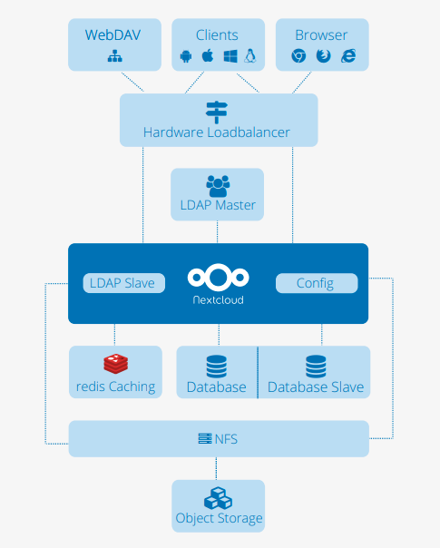
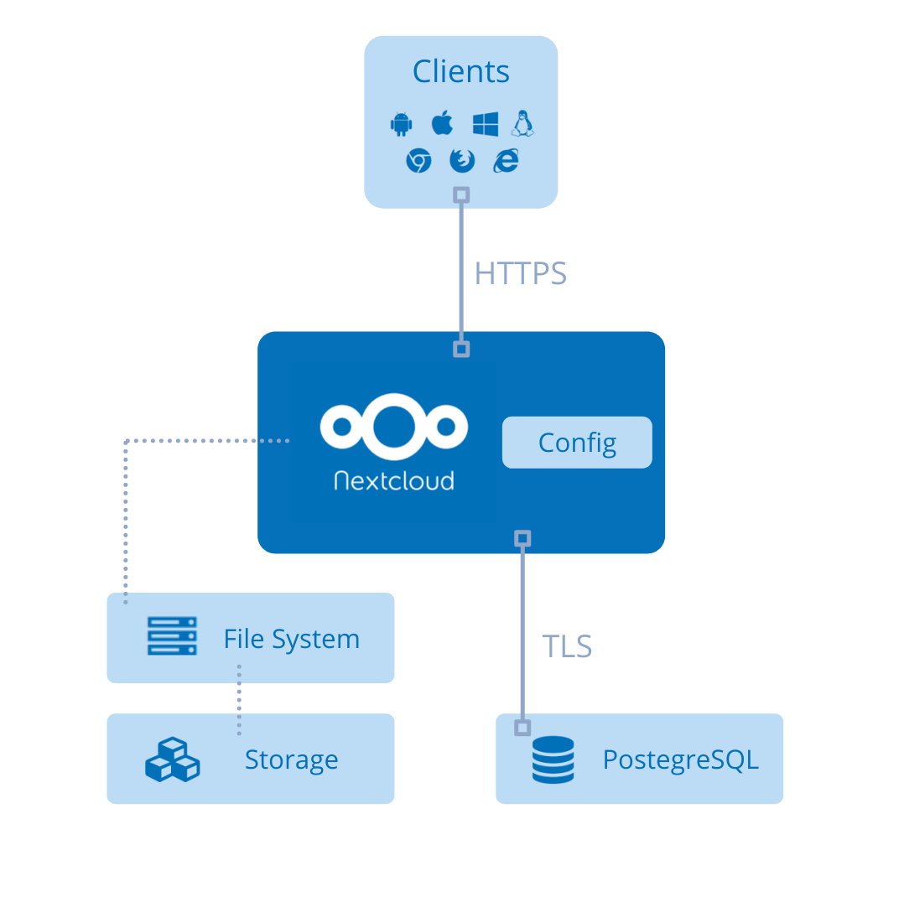
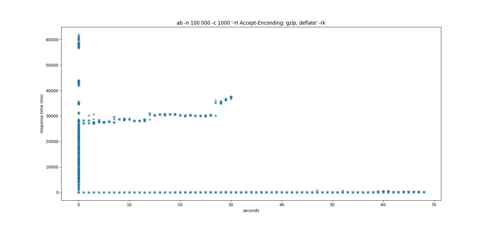
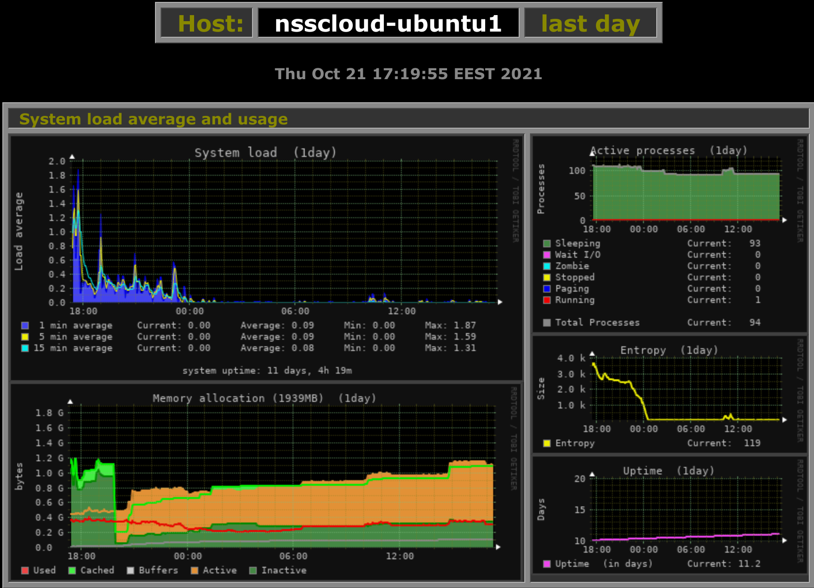

# NSS-Cloud Report
## 0 TOC

- [1 System Goals](#1-system-goals)
	- [1.1 Qualitative Goals](#11-qualitative-goals)
	- [1.2 Quantitative Goals](#12-quantitative-goals)
	- [1.3 Use Cases](#13-use-cases)
- [2 System architecture](#2-system-architecture)
	- [2.1 Nextcloud server architecture](#21-nextcloud-server-architecture)
	- [2.2 NSS-cloud adoption](#22-nss-cloud-adoption)
- [3 Components](#3-components)
	- [3.1 Nextcloud](#31-nextcloud)
	- [3.2 PostegreSQL](#32-postegresql)
	- [3.3 LDAP](#33-ldap)
	- [3.4 Certification BOT](#34-certification-bot)
	- [3.5 Clients](#35-clients)
- [4 Communication](#4-communication)
- [5 Open source modules evaluation](#5-open-source-modules-evaluation)
	- [5.1 Nextcloud](#51-nextcloud)
	- [5.2 Let's Encrypt](#52-lets-encrypt)
	- [5.3 Optional nss-ca](#53-optional-nss-ca)
- [6 Fallacies](#6-fallacies)
	- [6.1 Network is reliable](#61-network-is-reliable)
	- [6.2 Latency is zero](#62-latency-is-zero)
	- [6.3 Infinite bandwidth](#63-infinite-bandwidth)
	- [6.4 Network is secure](#64-network-is-secure)
	- [6.5 Topology doesn’t change](#65-topology-doesnt-change)
	- [6.6 There is one administrator](#66-there-is-one-administrator)
	- [6.7 Transport cost is zero](#67-transport-cost-is-zero)
	- [6.8 Network is homogeneous](#68-network-is-homogeneous)
- [7 Further development](#7-further-development)
	- [7.1 Deployment](#71-deployment)
	- [7.2 Federation](#72-federation)
	- [7.3 Additional Services and Features](#73-additional-services-and-features)
	- [7.X Others](#7x-others)
- [8 Evaluation](#8-evaluation)
- [9 Conclusion / Learning](#9-conclusion-/-learning)

## Introduction
With the tentency to centalize cloud services on the Internet, we believe that one could benefit from their personal locally deployed system.

The project's [Github repository](https://github.com/jiricodes/nss-cloud) contains additional files and information.
　
## 1 System Goals
This section introduces primary goals of the system and serves as a basis for all decisions regarding the practical implementation of the system. The goals can generally be divided into two categories, qualitative goals and quantitative goals, though some may also fall into both. Additionally, we describe some potential use cases as keeping them in mind will allow us to design our system from the ground up to be used effectively in practice.

### 1.1 Qualitative Goals
**Privacy** is one of the core drivers and goals of this project. As more and more data, services, and even infrastructure (e.g. DNS resolution) are being centralized by the top players in the cloud industry, there is an increasing need for alternate options for those who need a guarantee of privacy and data confidentiality (resources TBC - confidential dns, confidential computing, GDPR). This need could be to some extent satisfied with personal cloud deployment on local network or self-hosted cloud.

**Security** goes hand-in-hand with privacy, as there cannot be any true privacy if the service is insecure, even if it is being self-hosted. This is also especially important considering that it is a "personal" cloud, which should be secure enough to safely store any sensitive personal data that users store on it.

### 1.2 Quantitative Goals
Depending on the use case, some quantitative metrics may be required or at least welcomed by the consumer.

**Reliability** of the service is crucial, and users' data should remain accessible and loss-proof at all times. The entire point of a personal cloud is storage, and if the service is unreliable and data is inaccessibly or lost, then it is a complete failure of the system.

**Performance** is use case and deployment-specific, but the software and protocols should introduce minimal performance overhead and be capable of running on low-end consumer machines, e.g. NUCs. Data storage is now a relatively simple task, especially at the basic consumer level, so poor performance should be a cause for concern.

### 1.3 Use Cases
To what end a user would like to utilise the system may widely vary. However, we will introduce few use cases for the NSS-cloud system.

The most basic and perhaps intended usage of the personal cloud is as a storage and sharing platform similar to other widely-used cloud platform (Google, iCloud etc.). However, due to its locality and low amount of users, the consumer benefits with high privacy guarantees and potentially much higher performance (HW dependant). This of course comes at the cost of wide availability outside of the local network. The tradeoff can be somewhat balanced by self-hosting the system, which on the other hand increases the attack surface.

Another use could be seen by combination of the personal cloud with a home assistant (e.g. open source [Home Assistant](https://www.home-assistant.io/)), which would have similar benefits as above mentioned use case. Additionally, this would lower chance of external misuse and improved responsiveness and debugging of the home assistent settings. 

One rather complex, DIY-style, application could be seen with development of custom security cameras. That could potentially be even connected to the previous use case. One could recycle old smartphone to serve as a security camera feed (e.g. over TLS) to the home server, where for example with framework like [OpenCV](https://opencv.org/) the images are processed for object detection or individuals identification. The personal cloud could play various roles in this model, from data processing, storing to interfacing such model using its API, and mitigating the thread of possibly sensitive data leakage.

## 2 System architecture
### 2.1 Nextcloud server architecture

*Figure 1 - Scalable Nexcloud setup example. Nextcloud server at the center, NFS (Network file system) as storage layer at the bottom, an LDAP (Lightweight Directory Access Protocol) user directory, REDIS caching, multiple databases and loadbalancer.  [\[NC-WP\]](#nc-wp)*

The core of a Nextcloud setup is the Nextcloud server, which is a PHP-based web application for a Linux webserver such as Apache or NGINX. A typical deployment uses the "LAMP" stack: Linux, Apache, MySQL/MariaDB, and PHP. The database in the stack (MySQL/MariaDB are recommended but PostegreSQL is also supported) stores file sharing information, user details, application data, configuration and file information for the Nextcloud server. For the storing of files, Nextcloud's storage layer supports many server-mounted storage protocols, though an off-the-shelf NFS such as IBM Elastic Storage  or  RedHat  Ceph is recommended and most often used. The storage layer can be run on the same server as Nextcloud, or on a different server through the Nextcloud interface. [\[NC-WP\]](#nc-wp)

There are a variety of options for accessing and managing the data stored within a Nextcloud instance. Nextcloud's web interface is supported across all major browsers and operating systems, and allows users to access and manage their stored files. Nextcloud also offers official desktop (Windows/macOS/Linux) and mobile (Android/iOS) applications with file syncing capabilities. Nextcloud fully supports WebDAV as well, so file management can be done directly through the operating system (i.e. mapping a network drive in Windows) or with third-party applications that support WebDAV such as Filezilla.

### 2.2 NSS-cloud adoption

*Figure 2 - NSS cloud architecture. Clients connect to Nextcloud over HTTPS. The default OS filesystem is used as the storage layer. The PostgreSQL database runs in a container accessed via TLS.*

Since our primary goal is a personal-use of the cloud server for file storage (see [1.3 Use Cases](#13-use-cases)), we do not expect a high-traffic environment and the whole system should be able to fit on low-spec consumer hardware (e.g. NUC). This means that many of the additional features depicted in the scalable Nextcloud setup[Figure 1](#figure-1) are unneccessary and can be eliminated to save on space, processing power, and complexity. Specifically, the REDIS caching server, the hardware loadbalancer, multiple seperate database servers, and even NFS for the storage layer are not required for our use case. Hence, our setup is structured as depicted in [Figure 2](#figure-2).

The Nextcloud server system is setup to run within a single virtual machine (VM). The VM is CSC cPouta standard.small [\[Pouta-Flavors\]](#pouta-flavors) flavor. It has 2 vCPUs and 2GB RAM allocated to it, and contains a minimal default installation of the Ubuntu Server 20.04 operating system.  The Nextcloud server is natively installed and configured on the VM's operating system, rather than in a container). The system's database is a PostgreSQL database running inside of a Docker container hosted by the VM. Communication to and from the PostgreSQL server is done over TLS. The database has restricted access to resources, with 384MB for storage (plus additional 384MB swap space) and is limited to at most 0.5 vCPU usage. The Linux native file system interface is used for object storage.

Clients can connect using either the Nextcloud app available on all major operating systems or via the web browser interface. 

## 3 Components

As stated above, the system as a whole runs within a VM running Ubuntu Server 20.04 containing an Apache webserver. For administration purposes, the VM itself exposes a port to the Internet for secure SSH connection. Ports are also exposed to allow clients to connect to the webserver via HTTPS and manage files using Nextcloud's web interface.

### 3.1 Nextcloud
NSS-cloud's most important component is the Nextcloud server instance. It is directly installed ([Nextcloud docs](https://docs.nextcloud.com/server/latest/admin_manual/installation/source_installation.html)) in the VM inside the webserver, and the installation also comes bundled with all of the required PHP modules. The Nextcloud server is primarily responsible for managing file access and processing for NSS-cloud, acting as the mediator between users/clients and the files stored on the server. The exposed ports in the webserver allow clients to connect to the Nextcloud server via HTTPS and access/manage the files stored within. The Nextcloud server also requires the usage of a database, which it connects to using TLS 1.3.

### 3.2 PostgreSQL
The database used by NSS-cloud for its Nextcloud server instance is a PostgreSQL database. It is hosted on the same VM as the Nextcloud server, though within a Docker container. The database is used by the the Nextcloud server to store file sharing information, user details, application data, configuration and file information, as mentioned in [Section 2.1](#21-nextcloud-server-architecture). It is only connected to the Nextcloud server outside the Docker container, via TLS 1.3. 

### 3.3 LDAP
User authentication for NSS-cloud is managed by LDAP. LDAP was chosen as it is recommended for use with Nextcloud, vendor-neutral with a compatible php version, simple, and lightweight. For LDAP authentication to be used, an LDAP server is required, which in this case is hosted within a Docker container on the same VM as the Nextcloud server (similar to the database). The LDAP server communicates with the Nextcloud server using a secure TLS connection.

### 3.4 Certification BOT (Certbot by EFF)
Certbot maintains NSS-cloud's Let's Encrypt certificate. A valid certificate issued by a Certificate Authority that proves one has control over a domain is required to use secure protocols such as TLS and HTTPS (which is based on TLS). Let's Encrypt offers a free certificate service, however each certificate is only valid for 90 days, so Certbot automatically renews the certificate when it expires. It has minimal contact with most of the system, and only contacts Let's Encrypt to renew the certificates and then saves them to Apache for Nextcloud and PostgreSQL to use for TLS and HTTPS connections.

## 4 Communication

The main mode of communication between modules is TLS 1.3, which the Nextcloud server uses to communicate with the PostgreSQL database and the LDAP server. TLS stands for Transit Layer Security, and is a cryptographic communication protocol for computer networks. TLS is secure protocol that runs in the network's application layer, intended to facilitate secure communication between computer programs that are also at the application layer. This is why TLS is primarily used by NSS-cloud's components to communicate. 

A TLS connection consists of two parties: the client which initiates by sending a request, and the server which receives and responds to the request. In NSS-cloud, for example, the Nextcloud server instance acts as the client when it requests file information for a particular file from the PostgreSQL database, which acts as the server. The connection begins with a handshaking procedure, used to establish the security protocols for the ensuing communication. The client and server first negociate a shared cipher to be used for encryption. Then, the server sends proof of its identity in the form of a certificate issued by a certificate authority, vouching for the server's identity. This is why the Let's Encrypt certificate is required, since every TLS communication, even between components in the same VM, requires one. If the client's verification of the certificate is succesful, private keys are generated for the encryption of the following communication session. From there, the client and server exchange data and communicate, using their session keys to encrypt and decrypt the transmissions. The major security benefits that result are that the handshaking protocol/negotiation render attacks by even those in the middle of the connection ineffective, not just eavesdroppers at the ends. Data integrity is also assured, safe from either tampering or data loss/corruption, thanks to a message authentication code transmitted with each message.

While all of the internal components of NSS-cloud communicate via TLS, the web clients communicate with the Nextcloud server instance over HTTPS, the "secure" form of HTTP. However, said security is in fact provided by TLS as well, with HTTPS sometimes being referred to as HTTP over TLS. This is exactly what it sounds like: the client and server still exchange data using HTTP, with all of it being secure using TLS as described in the previous paragraph.

The ip that Nextcloud is using is force in the configuration to use only TLS. So there is no possiblilty that the connection would not be encrypted. The certificate is also from Lets Encrypt and are copied during Docker init from diskdrive to PostgreSQL configuration directory and also TLS is put on with commandline option. SSL must be used if the database is not on the same server as the Nextcloud instance, which is not currently the case with our project.

## 5 Open source modules evaluation
Richard Stallman (GNU, FSF) has stated:

> Free software is a matter of liberty, not price. You should think of *free* as in *'free speech,'* not as in *'free beer'*.

A quotation that has shaped minds of developers over decades and became the foundation of open source world. This philosophy has enabled modern complex systems to exist efficiently and will continue to drive the software industry forward.[\[FORB-OS\]](#forb-os) Also it is important to understand that *free software* does not mean *noncommercial*, on the contrary a free code must be available for commercial use. [\[GNU-FREE\]](#gnu-free)

One complication with modern open world systems, at least from beginners perspective, is that there is many licences that define *open source* or *free software* and their compatibilites largely varies. Therefore, selecting a correct lincense for your own open source project may not be trivial.

### 5.1 Nextcloud
One major benefit of Nextcloud is that it is free and open source, which makes it affordable for individual consumers (and students). As we have mentioned above, privacy and security are two major consideration when it comes to a personal cloud, and the fact that Nextcloud is open source makes it easy for end users or other third parties to audit the software, without having to rely only on trusting the Nextcloud organization when they say their software is secure. This can also be a drawback, however, because the code is also visible to potential malicious parties, who can easily read the code and find bugs or other weaknesses that can be exploited. Another benefit for consumers is that Nextcloud can run very lightweight on inexpensive, easy to acquire hardware such as a RaspberryPi, though also offers the option to scale up very large for those who might need it. On the development side, the modular architecture of Nextcloud allows developers like our group the option to extend it with custom features, or with other useful extensions developed by third parties. Nextcloud also has very easy, beginner-friendly basic setup, and fairly comprehensive documentation that makes it easy to work with, even as a newcomer.

### 5.2 Let's Encrypt
It is difficult to find many flaws with Let's Encrypt, which is free, simple, quick, and very well documented. One downside arguably is that Let's Encrypt certificates only last [90 days](https://letsencrypt.org/2015/11/09/why-90-days.html), which can lead to downtime if they are not renewed on time since TLS and HTTPS connections will stop working without a valid certificate. However, using the [EFF's Certbot](https://certbot.eff.org/) (also [free and open source](https://github.com/certbot/certbot)) as we did, this becomes a trivial issue as Certbot automatically takes care of renewing the certificates when they expire. Another possible downside is the fact that Let's Encrypt [only offers domain-validated certificates](https://letsencrypt.org/docs/faq/), but the other certificate types (Extended validation and organization validation) are not at all neccessary for the scope of this project. For our purposes, Let's Encrypt was clearly the best choice and had no significant downsides.

### 5.3 PostgreSQL
As with many other components used in this project, PostgreSQL is free and open source. It's known to have quite good performance and fast data access, which is beneficial for running on potentially lower-spec consumer hardware. It also has improved data integrity, as it doesn't change data by automatically correcting data types. However, this can also be a downside to some, as the convenience of automatic correction is sometimes worth the drop in data integrity. PostgreSQL also has some optimization features such as Partial Indexing, but those probably aren't needed in a personal cloud. One major downside related to our specific architecture is that the usage of PostgreSQL with Nextcloud isn't as smooth as with MariaDB/mySQL, as PostgreSQL isn't explicitly recommended for use with Nextcloud. However, due to some issues detailed later on in the report, PostgreSQL had to be settled for. Also, for a small project, PostgreSQL may be more robust than necessary, and other options such as mariaDB could offer smaller database sizes in exchange, for example. Lastly, PostgreSQL doesn't support table partitioning, which could sometimes be a nice feature to have.

### 5.4 NSS-ca
The [nss-ca](https://github.com/jiricodes/nss-cloud/tree/master/nss_ca) is a self created certificate chain generation and signing script based on widely used [OpenSSL](https://www.openssl.org/). For local network deployments there's no need for verified trust anchor like Let's Encrypt, one usually can trust themself. Also general trust anchors require the certificate to be bound to a specific domain, which may couse troubles in this case since the domain is most probably missing and is substituted with local IP address. It is important to understand that the generated certificates won't be trusted by third parties.

The OpenSSL is well known and widely used open source crypto library and tools collection. However it is also commonly known that the documentation can be ambiguous at times and the learning curve to use OpenSSL efficiently and securely is fairly steep.

## 6 Fallacies

The Eight Fallacies (set of assertions) of Distributed Computing were authored by L Peter Deutsch and others from Sun Microsystems in 1990's. [\[FALL-10\]](#fall-10) We describe NSS-cloud's position with regards to each of the fallacies.

### 6.1 Network is reliable
The network doesn't allways be reliable for our application, but if network failures happen too often or if the file that is being downloaded/uploaded is very big things can get annoying. Downloading and uploading are prone to failure if the network isn't reliable enough which can lead to the entire process being restarted. This becomes increasingly annoying as the size of the file grows and network reliability goes down. Having to restart 1 hour long download multiple times starts to eat away at person's will to live.

### 6.2 Latency is zero
The components of NSS-cloud are all within the same VM, so the latency between them will be effectively zero. When connecting with the client application, ff the personal cloud is hosted within the local network, then the latency will also be very low. However, if the personal cloud is being hosted remotely, then connecting with the client will lead to some latency. This is not a huge concern, though, since there are no latency-critical parts of the application, and particularly bad cases can be handled by the networking protocols.

### 6.3 Infinite bandwidth
Bandwidth should not be a large issue for our system as a personal cloud should not be seeing very much usage from multiple concurrent users, but unneccessary data loading is avoided as a rule so that the user experience can remain smooth.

### 6.4 Network is secure
Our system makes every effort to use secure communication whenever possible, with client communication via HTTPS and internal communication with TLS. Further consideration could be made to run the system in HSM^based secure VM (e.g AMD-SEV/SNP, Intel TDX or Arm CCA in the future) or shifting the system to a container rather than VM and bootstrapping it with HSM (Intel SGX, RISC-V Keystone, TPM 2.0 etc.). This would secure internal communication and compute to the extent that even physical access to the system would not reveal any sensitive information*.

*We're aware of potential vulnerabilities that allow side-channel attacks of the aforementioned systems, however they are out of the scope of this project.

### 6.5 Topology doesn’t change
Since all of NSS-cloud's components are within a VM, the topology of the "inner" network does not change. However, the "portability" of a VM means that there is a lot of potential for the network outside the VM to change, sometimes drastically. For example, a user may host the VM on their local machine, but then decide to move it to a remote hosting service. From the perspective of the VM, the exterior network topology completely changes when it moves from the local machine to the remote host.

### 6.6 There is one administrator
As a personal cloud, most users will likely only have one adminstrator (themselves), but if they so desire, Nextcloud supports designating multiple administrators, and further-specified roles can be delegated to support customized administration topology. [\[NC-WP\]](#nc-wp)

Additionally, the underlying OS (Ubuntu 20.04) also supports multiple users which can belong to different administrative groups. These users can be accessed through ssh and multiple users can connect at the same time. [\[UBUNTU-USERS\]](#ubuntu-users)

### 6.7 Transport cost is zero
For personal cloud, this is largely irrelevant. The infrastructure of personal home server wouldn't normally be that big, and when renting cloud services, a personal server doesn't need unpredictable, scaleable solutions. In the data transfer itself, in Finland, the only thing that usually costs something is the bandwidth and not the amount of data (at least on personal scale). For users that have limited data, this can be avoided by avoiding loading unecessary data or compressing file transfers. For example, only small previews of images are downloaded automatically to save data.

### 6.8 Network is homogeneous
Nextcloud and our system us and support various communication protocols and APIs, so the network topology and architecture is very far from being homogeneous.

## 7 Further development
Since NSS cloud is targeted for personal use and generally on local network, there's a plenty of room for expanding the set of features and functinalities.

### 7.1 Deployment
Current deployment is not automated and it remains as one of the major development milestones. Automation is crucial for wider use and user friendliness, whether it is done through scription or containers. From our experience the setup ca be done quickly and the base installation doesn't take long. However the configuration process can be tedious, requires a certain level of expertise and is error prone.

For improved deployability all system components used could be containerized. This would enable automated and centralized deployment which in turns offers ease of deployment and migration.

Nextcloud maintains [stable docker container](https://hub.docker.com/_/nextcloud) configuration, which is a good place to start.

### 7.2 Federation
People on different servers can share files together. Though people still need to log into their own server, this can help extending the system and make communication between users of different servers possible.

### 7.3 Additional Services and Features
Nextcloud provides user friendly *app store* where once can pick from many available services raging from customization, communication, collaborations through security all the way to games. This allows users to personalize their own nextcloud to target their exact needs.

However, if users' needs exceed the supply of native applications Nextcloud's WebDAV standard complient API gives an opportunity to independently create custom services.

## 8 Evaluation
	Methodology used for evaluating the system performance, and the key results
	Needs ALOT of polishing

- hardware resource usage (idle and under load)
- latency, throughput / bandwidth?
- user experience testing

Tools and setup
ab for pounding - see how much load the server can take.
https://httpd.apache.org/docs/2.4/programs/ab.html
ab -n 100_000 -c 1000 "-H Accept-Encoding: gzip, deflate" -rk

The command sends 1000 concurrent request at a time of a total 100_000 requests

Output of Apache Bench plotted with gnuplot?
https://www.bradlanders.com/2013/04/15/apache-bench-and-gnuplot-youre-probably-doing-it-wrong/

As displayed in [Figure 3](#figure-3) benchmarking is hard.

uploading CENTOS iso to test if having encryption on affects
 CentOS-8.4.2105-x86_64-dvd1.iso  9.2 GB

curl basic authentication to test upload:
https://docs.nextcloud.com/server/20/user_manual/en/files/access_webdav.html#accessing-files-using-curl

Nextcloud supports the WEbDAV protocol and allows for syncronization of files over WebDAV.

time curl -u user:pass -T ./CentOS-8.4.2105-x86_64-dvd1.iso "https://vm3984.kaj.pouta.csc.fi/remote.php/dav/files/USERNAME/DIRECTORY/CentOS-8.4.2105-x86_64-dvd1.iso"

|  | transfer #1 | transfer #3 | transfer #2 | transfer #4 | transfer #5 | transfer #6 | transfer #7 | transfer #8 | transfer #9 |
|---|---|---|:---:|:---:|:---:|:---:|:---:|:---:|:---:|
| real | 6m57.826s | 10m40.263s | 10m33.771s | 6m32.421s | 10m28.944s | 10m11.158s | 6m37.737s | 9m59.962s | 10m7.240s |
| user | 0m9.970s | 0m9.568s | 0m9.244s | 0m9.387s | 0m9.595s | 0m9.527s | 0m9.423s | 0m9.314s | 0m9.785s |
| sys | 0m18.034s | 0m14.672s | 0m13.850s | 0m14.601s | 0m15.734s | 0m16.407s | 0m15.641s | 0m15.541s | 0m15.519s |

table of times measured for CentOSImage

We noticed that uploading large file raises CPU load average to near 2. This has noticable impact on the NSSCloud service that was noticed with manually navigating in the Nextcloud Web interface. Memory consumption was not noticeably affected, it remained at steady ~530MB/1.89GB throughout the upload.

screenshots from monitorix load average and MEM usage here

For future: benchmark without encryption on to see if it affects and how much.

To get more holistic understanding of how NSSCloud performs under laod we would need to do more kokonaisvaltainen benchmarking, we would need to profile and benchmark the NSSCloud code with various different types of request. Our ab approach only requests the same welcome page over and over again.

For performance evaluation
ab - Apache HTTP server benchmarking tool
implement users to have more pages to hammer at the same time

Future bettering, Munin - a resource monitoring tool, an upgrade from monitorix 

## 9 Conclusion / Learning

Nextcloud feels like a great DIY cloud playground.

We also learned a lot about working with limited computing resources, since the CSC Pouta standard.small VM really is quite small. This does align quite neatly with our main goal of making a personal cloud for users that may end up even hosting it on their low-spec consumer hardware. The constrained VM we worked with ended up as our own model of said low-spec consumer hardware, which is (to many of us) a new development strategy that we may find ourselves using again in the future when working with real-world constraints. In this specific case, we identified the Docker containers that some of the system's components ran in as one of the best avenues for making sure there was enough processing power to go around within the VM. Using several command line arguments, hard and soft memory limitations can be placed on the CPU resources available to a Docker Container. The PostgreSQL container was allocated 384 MB with an additional 384 MB available for swapping, and its CPU cycles utilization was capped at 50% of one of the cores on the VM.   

One of the areas where we ran into problems was with trying to setup the database for the Nextcloud server. Originally, we started out with MariaDB, which is recommended for use with Nextcloud according to their documentation. But, we started to run into problems when it came to the Nextcloud server connecting to the database, and got a strange error message: "Error while trying to initialise the database: An exception occurred while executing a query: SQLSTATE[HY000]: General error: 4047 InnoDB refuses to write tables with ROW_FORMAT=COMPRESSED or KEY_BLOCK_SIZE." At first, we tried to debug it, but after many unsuccesful Google searches and perusals of the Nextcloud documentation and support material, we decided to pivot. While MariaDB and mySQL are recommended for usage with Nextcloud, according to the documentation PostgreSQL is supported as well. So, we decided that our best option was to try and replace MariaDB with PostgreSQL. Despite not being recommended by Nextcloud, PostgreSQL ended up working for us better than MariaDB, and so our system ended up using PostgreSQL. The takeaway for us is that when it comes to open source software and modules, there are often many comparable options, and if one doesn't work, then another one might work fine without losing any essential functionality.

## Resources
<a id="nc-wp">\[NC-WP\]</a> - Nextcloud Solution Architecture whitepaper. [Link](https://nextcloud.com/media/wp135098u/Architecture-Whitepaper-WebVersion-072018.pdf). Accessed 09.10.2021.

<a id="pouta-flavors">\[Pouta-flavors\]</a> - Virtual machine flavors and billing unit rates. cPouta documentation. [Link](https://docs.csc.fi/cloud/pouta/vm-flavors-and-billing/). Accessed 12.10.2021

<a id="gnu-free">\[GNU-FREE\]</a> - GNU Philosophy: What is Free Software?. [Link](https://www.gnu.org/philosophy/free-sw.en.html). Accessed 18.10.2021

<a id="forb-os">\[FORB-OS\]</a> - Why Is Open-Source So Important? Part One: Principles And Parity. [Link](https://www.forbes.com/sites/charlestowersclark/2019/09/24/why-is-open-source-so-important-part-one-principles-and-parity/?sh=6c89bbd861f7). Accessed 18.10.2021

<a id="fall-10">\[FALL-10\]</a> - Deutsch's Fallacies, 10 Years After. [Link](https://web.archive.org/web/20070811082651/http://java.sys-con.com/read/38665.htm). Accessed 18.10.2021

<a id="ubuntu-users">\[UBUNTU-USERS\]</a> - Add a new user account. [Link](https://help.ubuntu.com/stable/ubuntu-help/user-add.html.en). Accessed 19.10.2021
